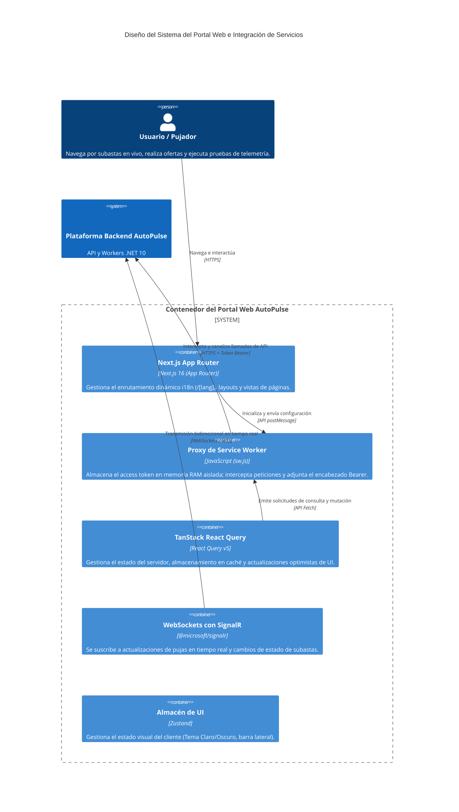

# Portal Web AutoPulse 🚗💨

**Portal Web AutoPulse** es un cliente moderno, responsivo y profesional para subastas de vehículos en tiempo real, construido utilizando React 19 y Next.js 16. El portal cuenta con actualizaciones de pujas por WebSockets en tiempo real, visualizaciones de rendimiento de telemetría, aislamiento de tokens en memoria conforme a OWASP y enrutamiento localizado.

---

## 🏛️ Diseño del Sistema y Arquitectura C4

La aplicación frontend está diseñada en torno a patrones de arquitectura modernos que priorizan la reutilización de componentes, el alto rendimiento, la conectividad en tiempo real y la comunicación segura con los servicios backend.

### C4 Nivel 2: Diagrama de Contenedores e Integración del Portal Web

El siguiente diagrama ilustra cómo el Portal Web en Next.js coordina el estado del cliente, el aislamiento en hilos secundarios (Service Worker), la localización dinámica y las conexiones WebSockets con los servicios de backend.



---

## 💡 Patrones Clave de Arquitectura e Integración

### 1. Integración con Sagas del Backend y Pujas en Tiempo Real
- **Transmisión por WebSockets:** Integra `@microsoft/signalr` para conectarse directamente a las actualizaciones de estado de la Saga `AuctionBookingSaga` del backend.
- Cuando una subasta finaliza, las transiciones de estado (ejemplo: `ProcessingPayment`, `Completed` o `Compensating`) se transmiten en tiempo real a la interfaz sin necesidad de recargar la página.

### 2. Visualizador del Benchmark de Telemetría con `Span<T>`
- El panel web incluye un módulo interactivo de pruebas de rendimiento que dispara el endpoint del backend `POST /api/telemetry/benchmark`.
- Muestra gráficamente las diferencias de rendimiento entre el parser tradicional (`string.Split`) y la optimización de asignación cero con `ReadOnlySpan<char>`, detallando tiempos de ejecución y conteos del Garbage Collector (Gen 0/1/2).

### 3. Aislamiento Seguro de Tokens en Memoria (Mitigación OWASP A03:2021)
- **Inmunidad a XSS:** El `accessToken` se almacena estrictamente en la memoria RAM de un hilo de ejecución secundario (Service Worker `sw.js`). Al estar completamente aislado del DOM y de `window`, se neutraliza cualquier intento de exfiltración de tokens mediante ataques XSS.
- **Interceptación de Red Transparente:** El Service Worker actúa como un proxy interceptando las llamadas fetch/XHR hacia el backend, inyectando el encabezado `Authorization: Bearer <token>` directamente en tránsito a nivel de red.

### 4. Cola de Refresco de Tokens Única (Single-Flight) e Inicialización Silenciosa
- **Mecanismo de Semáforo (Single-Flight Lock):** El cliente HTTP intercepta errores `401 Unauthorized`. Si hay múltiples peticiones concurrentes que fallan con 401, el semáforo bloquea peticiones de refresco duplicadas, metiéndolas en una cola (`failedQueue`) que se resuelve de golpe una vez obtenido el nuevo token.
- **Inicialización Silenciosa (App Bootstrapping):** Tras una recarga de página (F5), el estado de sesión se hidrata de forma transparente mediante un refresco silencioso (`POST /api/auth/refresh-token`), validando la cookie HTTP-Only `autopulse-refresh-token`.

### 5. Internacionalización y Localización (i18n)
- Aprovecha el enrutamiento dinámico de Next.js mediante el segmento `/[lang]` (soporta inglés `en` y español `es` de manera nativa).
- Un **Middleware de i18n** gestiona las preferencias de idioma inspeccionando los encabezados `Accept-Language` del cliente, redirigiendo al predeterminado `/en` si no se especifica un segmento de ruta.

---

## 📂 Estructura de Directorios

```lic
autopulse-web/
├── dictionaries/                 # Diccionarios de traducción i18n (en.json, es.json)
├── public/                       # Activos estáticos y Service Worker (sw.js)
└── src/
    ├── app/                      # Raíz del App Router de Next.js
    │   ├── [lang]/               # Segmento dinámico de idioma para enrutamiento
    │   │   ├── auctions/         # Páginas de subastas y paneles detallados
    │   │   ├── auth/             # Vistas de Inicio de Sesión / Registro
    │   │   ├── dashboard/        # Vistas de perfil de usuario
    │   │   └── page.tsx          # Vista principal / Home
    │   ├── api/                  # Rutas de servidor local de Next.js
    │   │   └── carsxe/           # Proxy para la API de imágenes de CarsXE
    │   ├── globals.css           # Directivas globales de Tailwind y tokens de diseño
    │   └── providers.tsx         # Contenedor de proveedores (QueryClient, Auth, Tema)
    ├── components/               # Componentes de React UI
    │   ├── auctions/             # UI de subastas (Listas de pujas, widgets de telemetría)
    │   ├── layout/               # Diseños de Cabecera, Pie de Página y Barra Lateral
    │   └── ui/                   # Componentes atómicos reutilizables (Tarjetas, Modales, Listas)
    ├── hooks/                    # Hooks de React personalizados (useCountdown, useAuth)
    ├── lib/                      # Configuraciones base (SignalR, inicialización de QueryClient)
    ├── services/                 # Servicios de integración HTTP con la API del backend
    └── types/                    # Definición estricta de tipos de TypeScript
```

---

## 📦 Stack Tecnológico y Versiones de Paquetes

### Entorno Base
* **Framework:** Next.js `16.2.10` (App Router y Turbopack)
* **Lenguaje:** TypeScript `5.x` (Modo Estricto)
* **Estilos:** Tailwind CSS `v4.0` (Enfoque CSS-First con PostCSS)
* **Gestor de Paquetes:** pnpm

### Dependencias Principales

| Paquete | Version | Descripción |
| :--- | :--- | :--- |
| `react` / `react-dom` | `19.2.4` | Motor de renderizado basado en componentes |
| `@tanstack/react-query` | `5.101.2` | Gestión del estado del servidor y caché de consultas |
| `@tanstack/react-virtual` | `3.14.6` | Virtualización de filas para listas extensas de subastas |
| `zustand` | `5.0.14` | Contenedor de estado global para configuraciones locales de UI |
| `@microsoft/signalr` | `10.0.0` | Conexión WebSocket en tiempo real a los Hubs del backend |
| `react-hook-form` | `7.82.0` | Lógica de manejo y validación de formularios |
| `zod` | `4.4.3` | Biblioteca de validación y declaración de esquemas |
| `dompurify` | `3.4.12` | Sanitización de HTML para bitácoras de telemetría |
| `react-hot-toast` | `2.6.0` | Notificaciones flotantes animadas en la interfaz |

---

## 💻 Desarrollo Local

### 1. Instalar Dependencias
Asegúrate de tener [pnpm](https://pnpm.io/) instalado:
```bash
pnpm install
```

### 2. Configurar Variables de Entorno
Crea un archivo `.env.local` en la raíz de la carpeta:
```env
NEXT_PUBLIC_API_URL=http://localhost:5000

# Configuración de la API de CarsXE
CARSXE_API_URL=https://api.carsxe.com
CARSXE_API_KEY=TU_API_KEY_DE_CARSXE
```

### 3. Iniciar el Servidor de Desarrollo
```bash
pnpm dev
```
La aplicación estará disponible en [http://localhost:3000](http://localhost:3000).

### 4. Compilar para Producción
Para validar tipos de TypeScript y empaquetar los archivos optimizados:
```bash
pnpm build
pnpm start
```
