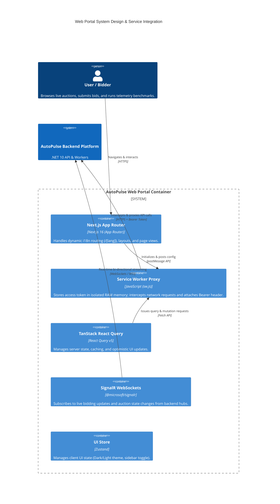

# AutoPulse Web Portal 🚗💨

**AutoPulse Web Portal** is a modern, responsive, and professional vehicle auction client dashboard built using React 19 and Next.js 16. It features real-time WebSocket bid updates, dynamic telemetry performance visualizations, OWASP-compliant token isolation, and localized routing.

---

## 🏛️ System Design & C4 Architecture

The frontend application is designed around modern UI architecture patterns that prioritize component reusability, high performance, real-time connectivity, and secure API client communications.

### C4 Level 2: Web Portal Container & Integration Architecture

The following diagram illustrates how the Next.js Web Portal coordinates client-side state, worker isolation, dynamic localization, and WebSocket connections with the backend services.



---

## 💡 Key Architectural & Integration Patterns

### 1. Integration with Backend Sagas & Real-Time Bidding
- **WebSocket Streaming:** Integrates `@microsoft/signalr` to bind directly to the backend's `AuctionBookingSaga` state updates.
- When an auction concludes, state updates (e.g. `PaymentProcessing`, `Completed`, or `Compensating`) are pushed live to the browser without requiring manual page reloads.

### 2. Zero-Allocation Telemetry Benchmark Visualizer
- The web dashboard includes an interactive benchmarking UI that triggers the backend endpoint `POST /api/telemetry/benchmark`.
- Visualizes real-time performance deltas comparing standard `string.Split` parsing against zero-allocation `ReadOnlySpan<char>` parsing, rendering execution time graphs and Garbage Collector (Gen 0/1/2) collection counts.

### 3. Secure In-Memory Token Isolation (OWASP A03:2021 Mitigation)
- **XSS Immunity:** The `accessToken` is stored strictly in the RAM memory of an isolated background browser thread (Service Worker `sw.js`). It is completely hidden from the main DOM and the `window` context, rendering XSS token exfiltration attacks impossible.
- **Transparent Network Interception:** The Service Worker intercepts outgoing requests directed to the API backend, dynamically injecting the `Authorization: Bearer <token>` header at the network level.

### 4. Single-Flight Token Refresh Queue & Silent Bootstrapping
- **Single-Flight Lock:** The network client centralizes error interception (`401 Unauthorized`). Under concurrent failed requests, a lock prevents multiple refresh requests from hitting the server by queuing them in a `failedQueue` and resolving them altogether once a new access token is obtained.
- **Silent Bootstrapping:** In-memory session state is hydrated upon reloading (F5) via a silent refresh endpoint (`POST /api/auth/refresh-token`), validating the HTTP-Only cookie `autopulse-refresh-token`.

### 5. Internationalization & Localization (i18n)
- Leverages Next.js dynamic routing with language segments `/[lang]` (supporting English `en` and Spanish `es`).
- A custom **i18n Middleware** negotiates client locales by inspecting `Accept-Language` headers, redirecting to the default `/en` when no segment is specified.

---

## 📂 Directory Structure

```lic
autopulse-web/
├── dictionaries/                 # i18n Translation dictionaries (en.json, es.json)
├── public/                       # Static assets & sw.js Service Worker
└── src/
    ├── app/                      # Next.js App Router root
    │   ├── [lang]/               # Dynamic language routing segment
    │   │   ├── auctions/         # Active auction pages and detail dashboards
    │   │   ├── auth/             # Login / Register views
    │   │   ├── dashboard/        # User profile views
    │   │   └── page.tsx          # Homepage view
    │   ├── api/                  # Next.js local server routes
    │   │   └── carsxe/           # CarsXE API image proxy
    │   ├── globals.css           # Global Tailwind directives and tokens
    │   └── providers.tsx         # Providers shell (QueryClient, Auth, Theme)
    ├── components/               # React UI components
    │   ├── auctions/             # Auction-specific UI (Bid list, telemetry widgets)
    │   ├── layout/               # Header, Footer, Sidebar layouts
    │   └── ui/                   # Reusable atomic UI (Cards, Modals, Lists)
    ├── hooks/                    # Reusable custom React hooks (useCountdown, useAuth)
    ├── lib/                      # Base configurations (SignalR hubs, QueryClient setups)
    ├── services/                 # Backend HTTP API integration services
    └── types/                    # Strict TypeScript type definitions
```

---

## 📦 Technology Stack & Package Versions

### Core Environment
* **Framework:** Next.js `16.2.10` (App Router & Turbopack)
* **Language:** TypeScript `5.x` (Strict Mode)
* **Styling:** Tailwind CSS `v4.0` (PostCSS approach)
* **Package Manager:** pnpm

### Main Dependencies

| Package | Version | Description |
| :--- | :--- | :--- |
| `react` / `react-dom` | `19.2.4` | Component-driven runtime engine |
| `@tanstack/react-query` | `5.101.2` | Server-state management and query caching |
| `@tanstack/react-virtual` | `3.14.6` | Row virtualization for heavy auction lists |
| `zustand` | `5.0.14` | Global state container for local UI configs |
| `@microsoft/signalr` | `10.0.0` | Real-time WebSocket connection to backend hubs |
| `react-hook-form` | `7.82.0` | Form handling and validation logic |
| `zod` | `4.4.3` | Schema declaration and validation library |
| `dompurify` | `3.4.12` | HTML sanitization for telemetry logs |
| `react-hot-toast` | `2.6.0` | Animated push notifications in the UI |

---

## 💻 Local Development

### 1. Install Dependencies
Make sure you have [pnpm](https://pnpm.io/) installed:
```bash
pnpm install
```

### 2. Configure Environment Variables
Create a `.env.local` file in the root of the directory:
```env
NEXT_PUBLIC_API_URL=http://localhost:5000

# CarsXE API Configuration
CARSXE_API_URL=https://api.carsxe.com
CARSXE_API_KEY=YOUR_CARSXE_API_KEY
```

### 3. Start Development Server
```bash
pnpm dev
```
The application will be running at [http://localhost:3000](http://localhost:3000).

### 4. Build for Production
To run TypeScript compilation and bundle optimized assets:
```bash
pnpm build
pnpm start
```
